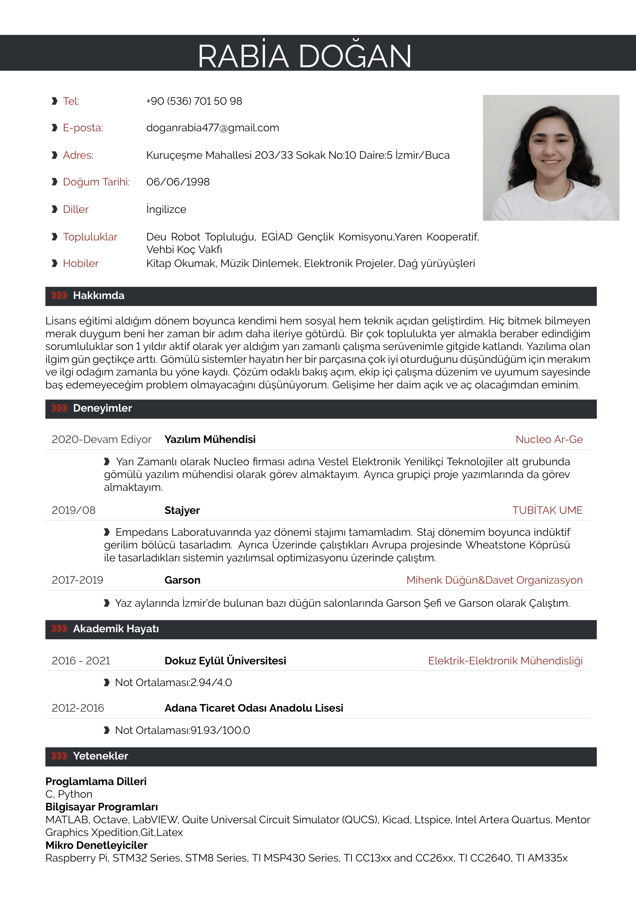
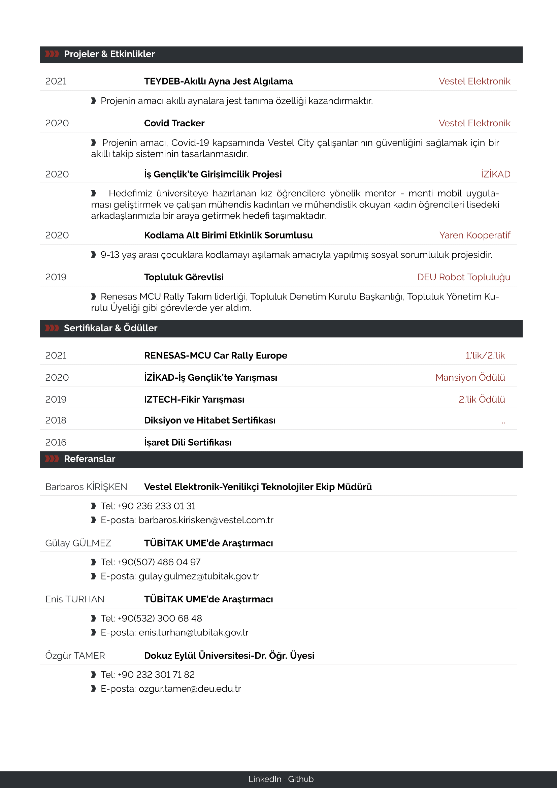

<h1 align="center">
  
   
  LaTex CV and Resume Collection
</h1>

  
  
  	

 
 

:necktie: A collection of simple and easy to use, yet powerful LaTeX templates for CVs and resumes. All of them are self designed and self implemented and not copied from template collections.

Now with support for Chinese, Japanese and Korean character encoding. Setup is only two lines of code! Read more <a href="docs/cjk/README.md">here</a>.

	
 

<table>
    <tr>
       	<th>My_CV</th>
       	<th>My_CV</th>
    </tr>
    	<tr>	
    		<td width="50%">
    			
    		</td>
    		<td width="50%">
    			    			
            </td>    	
    	</tr>
</table>

**Minimal environment**

You need a minimal tex-live distribution to compile the templates. No XeTeX or LuaTeX required. No other SDKs or environments required.

## How to build?

The following guide just briefly describes the requirements and build procedure as there are many ways to install a LaTeX distribution on various OS. Please create an issue, if this part is not helpful.

**Build Requirements**

You will need some minimal Texlive distrubution (The full texlive distribution is nearly 2GB large but you will need only a part of it). A good starting point is here: https://www.latex-project.org/get/#tex-distributions

If you want to install texlive from tug.org instead, you can use this guide: https://tug.org/texlive/

Users of various Linux distrubutions can also install texlive from their repositories.

This repo also contains a `texlive.profile` file in the project root, that can be used to install the minimum required texlive packages when manually installing texlive.

**Build Procedure**

 * Clone or download this project. 
 * Change to a template folder, which contains a `main.tex` file do
 * Edit the `main.tex` according to your CV credentials, optionally change settings and colors etc.
 * Run `pdflatex` (build/compile) 
 - The `main.pdf` should show the output.

## Contribution

**Contributors are very welcome**. You want to contribute? Awesome! Please check the [contribution guidelines](https://github.com/jankapunkt/latexcv/blob/master/CONTRIBUTING.md) first to make it a success.

